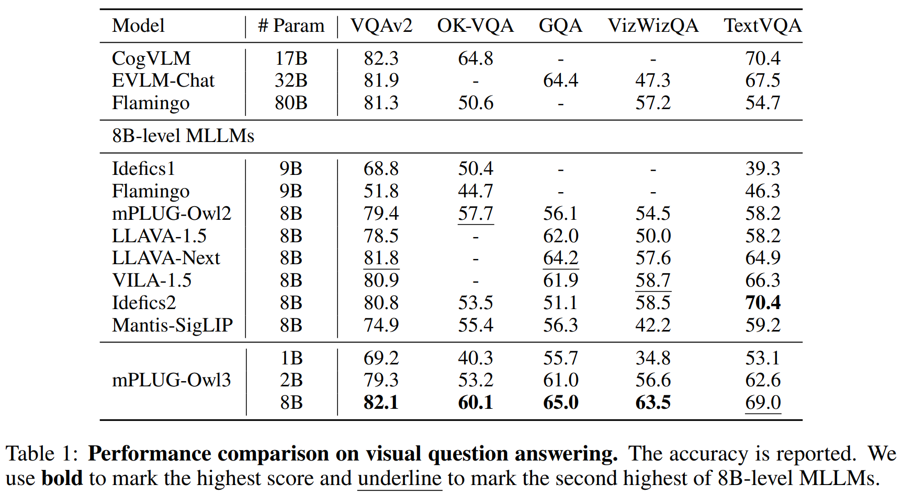
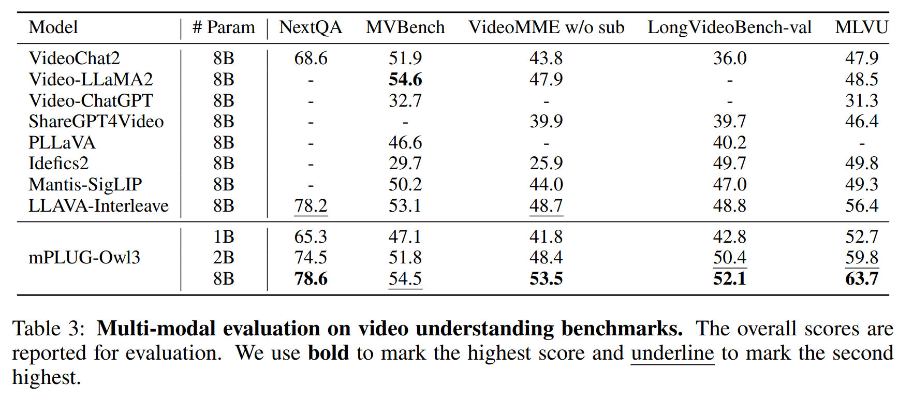
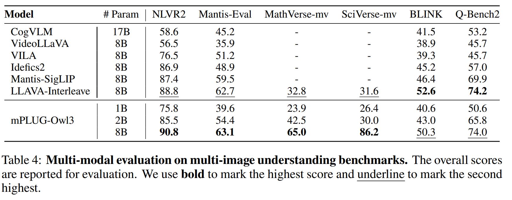

<div style="display: flex; align-items: center;">
  <h1>mPLUG-Owl3: Towards Long Image-Sequence Understanding in Multi-Modal Large Language Models</h1>
</div>

<div align="center">

</div>

<div align="center">
Jiabo Ye, Haiyang Xu, Haowei Liu, Anwen Hu, Ming Yan, Qi Qian, Ji Zhang, Fei Huang, Jingren Zhou
</div>
<div align="center">
<strong>Tongyi, Alibaba Group</strong>
</div>
<div align="center">
</div>


<div align="center">
    <a href="https://github.com/X-PLUG/mPLUG-Owl/blob/main/LICENSE"></a>
    <a href="https://arxiv.org/abs/2408.04840"></a>
    <a href="https://hits.seeyoufarm.com"></a>

</div>

---
**mPLUG-Owl3** 
<div align="center">
</div>


## News and Updates
* ```2024.09.23``` 🔥🔥🔥 Thanks to ms-swift. The finetuning of mPLUG-Owl3 is now supported. Refer to the document at [Finetuning of mPLUG-Owl3](https://github.com/modelscope/ms-swift/issues/1969#issue-2511475059).
* ```2024.09.23``` 🔥🔥🔥 We have released the evaluation pipeline, which can be found at [Evaluation](https://github.com/X-PLUG/mPLUG-Owl/tree/main/mPLUG-Owl3/evaluation)). Please refer to the README for more details.
* ```2024.08.12``` We release **mPLUG-Owl3**. The source code and weights are avaliable at [HuggingFace](https://huggingface.co/mPLUG/mPLUG-Owl3-7B-240728).

## Cases
mPLUG-Owl3 can learn from knowledge from retrieval system.


mPLUG-Owl3 can also chat with user with a interleaved image-text context.


mPLUG-Owl3 can watch long videos such as movies and remember its details. 


## TODO List
- [x] Evaluation with huggingface model.
- [ ] Training data releasing. All training data are sourced from the public datasets. We are preparing to release a compact version to facilitate easy training. Prior to this release, you have the option to manually organize the training data.
- [x] Training pipeline.

## Performance
Visual Question Answering

Multimodal LLM Benchmarks

Video Benchmarks

Multi-image Benchmarks



## Evaluation

To perform evaluation on the above benchmarks, first download the datasets from the official or huggingface sites: [ai2d](https://huggingface.co/datasets/lmms-lab/ai2d), [gqa](https://cs.stanford.edu/people/dorarad/gqa/download.html), [LLaVA-NeXT-Interleave-Bench](https://huggingface.co/datasets/lmms-lab/LLaVA-NeXT-Interleave-Bench), [LongVideoBench](https://huggingface.co/datasets/longvideobench/LongVideoBench), [mmbench](https://github.com/open-compass/MMBench), [mmvet](https://github.com/yuweihao/MM-Vet), [mvbench](https://huggingface.co/datasets/OpenGVLab/MVBench), [nextqa](https://huggingface.co/datasets/lmms-lab/NExTQA), [NLVR2](https://huggingface.co/datasets/lmms-lab/NLVR2), [okvqa](https://okvqa.allenai.org/download.html), [qbench2](https://huggingface.co/datasets/q-future/Q-Bench2-HF), [textvqa](https://textvqa.org/), [videomme](https://huggingface.co/datasets/lmms-lab/Video-MME), [vizwiz](https://vizwiz.org/tasks-and-datasets/vqa/), [vqav2](https://visualqa.org/download.html).
Then organize them as follows in `./evaluation/dataset`.

We provide the json files of some datasets [here](https://huggingface.co/datasets/StarBottle/mPLUG-Owl3-Evaluation), to help reproduce the evaluation results in our paper.

<!-- For benchmarks such as ai2d, NLVR2 and qbench2, you can download them from [lmms-lab](https://huggingface.co/lmms-lab). -->

<details>
<summary>click to unfold</summary>

```
├── ai2d
│   ├── data
│   └── README.md
├── gqa
│   └── testdev_balanced.jsonl
├── LLaVA-NeXT-Interleave-Bench
│   ├── eval_images_fix
│   └── multi_image_out_domain.json
├── LongVideoBench
│   ├── lvb_val.json
│   └── videos
├── mmbench
│   ├── mmbench_test_en_20231003.jsonl
│   └── mmbench_test_en_20231003.tsv
├── mmvet
│   └── mm-vet.json
├── mvbench
│   ├── json
│   ├── README.md
│   └── videos
├── nextqa
│   ├── MC
│   ├── NExTVideo
│   └── README.md
├── NLVR2
│   ├── data
│   └── README.md
├── okvqa
│   ├── okvqa_val.json
│   ├── mscoco_val2014_annotations.json
│   └── OpenEnded_mscoco_val2014_questions.json
├── pope
│   ├── ImageQA_POPE_adversarial.jsonl
│   ├── ImageQA_POPE_popular.jsonl
│   └── ImageQA_POPE_random.jsonl
├── qbench2
│   ├── data
│   └── README.md
├── textvqa
│   ├── textvqa_val_annotations.json
│   ├── textvqa_val.json
│   └── textvqa_val_questions_ocr.json
├── videomme
│   ├── data
│   └── test-00000-of-00001.parquet
├── vizwiz
│   └── vizwiz_test.jsonl
└── vqav2
    ├── v2_mscoco_val2014_annotations.json
    ├── v2_OpenEnded_mscoco_test2015_questions.json
    └── vqav2_test.json
```

</details>


Download the images of the datasets, and organize as follows in `./evaluation/images`,

<details>
<summary>click to unfold</summary>

```
├── gqa
│   └── images
├── mmbench_test_cn_20231003
│   └── images
├── mmbench_test_en_20231003
│   └── images
├── mmvet
│   └── images
├── mscoco
│   └── images
│       ├── test2015
│       └── val2014
├── textvqa
│   └── text_vqa
└── vizwiz
    └── test
```

</details>

Once the data is ready, run `./evaluation/eval.sh` for evaluation.
The datasets configuration can be modified in `./evaluation/tasks/plans/all.yaml`.


## Checkpoints
| Model Size | ModelScope | HuggingFace |
|------------|------------|-------------|
| 1B         | [mPLUG-Owl3-1B-241014](https://modelscope.cn/models/iic/mPLUG-Owl3-1B-241014) | [mPLUG-Owl3-1B-241014](https://huggingface.co/mPLUG/mPLUG-Owl3-1B-241014) |
| 2B         | [mPLUG-Owl3-2B-241014](https://modelscope.cn/models/iic/mPLUG-Owl3-2B-241014) | [mPLUG-Owl3-2B-241014](https://huggingface.co/mPLUG/mPLUG-Owl3-2B-241014) |
| 7B         | [mPLUG-Owl3-7B-240728](https://modelscope.cn/models/iic/mPLUG-Owl3-7B-240728) | [mPLUG-Owl3-7B-240728](https://huggingface.co/mPLUG/mPLUG-Owl3-7B-240728) |


## Usage

## Gradio Demo
Installing the dependencies
```
pip install -r requirements.txt
```

Execute the demo.
```
python gradio_demo.py
```
## Quickstart

Load the mPLUG-Owl3. We now only support attn_implementation in ```['sdpa', 'flash_attention_2']```.
```Python
import torch
from transformers import AutoConfig, AutoModel
model_path = 'mPLUG/mPLUG-Owl3-7B-240728'
config = AutoConfig.from_pretrained(model_path, trust_remote_code=True)
# model = mPLUGOwl3Model(config).cuda().half()
model = AutoModel.from_pretrained(model_path, attn_implementation='sdpa', torch_dtype=torch.half, trust_remote_code=True)
model.eval().cuda()
```
Chat with images.
```Python
from PIL import Image

from transformers import AutoTokenizer, AutoProcessor
from decord import VideoReader, cpu    # pip install decord
model_path = 'mPLUG/mPLUG-Owl3-7B-240728'
tokenizer = AutoTokenizer.from_pretrained(model_path)
processor = model.init_processor(tokenizer)

image = Image.new('RGB', (500, 500), color='red')

messages = [
    {"role": "user", "content": """<|image|>
Describe this image."""},
    {"role": "assistant", "content": ""}
]

inputs = processor(messages, images=image, videos=None)

inputs.to('cuda')
inputs.update({
    'tokenizer': tokenizer,
    'max_new_tokens':100,
    'decode_text':True,
})


g = model.generate(**inputs)
print(g)
```

Chat with a video.
```Python
from PIL import Image

from transformers import AutoTokenizer, AutoProcessor
from decord import VideoReader, cpu    # pip install decord
model_path = 'mPLUG/mPLUG-Owl3-7B-240728'
tokenizer = AutoTokenizer.from_pretrained(model_path)
processor = model.init_processor(tokenizer)


messages = [
    {"role": "user", "content": """<|video|>
Describe this video."""},
    {"role": "assistant", "content": ""}
]

videos = ['/nas-mmu-data/examples/car_room.mp4']

MAX_NUM_FRAMES=16

def encode_video(video_path):
    def uniform_sample(l, n):
        gap = len(l) / n
        idxs = [int(i * gap + gap / 2) for i in range(n)]
        return [l[i] for i in idxs]

    vr = VideoReader(video_path, ctx=cpu(0))
    sample_fps = round(vr.get_avg_fps() / 1)  # FPS
    frame_idx = [i for i in range(0, len(vr), sample_fps)]
    if len(frame_idx) > MAX_NUM_FRAMES:
        frame_idx = uniform_sample(frame_idx, MAX_NUM_FRAMES)
    frames = vr.get_batch(frame_idx).asnumpy()
    frames = [Image.fromarray(v.astype('uint8')) for v in frames]
    print('num frames:', len(frames))
    return frames
video_frames = [encode_video(_) for _ in videos]
inputs = processor(messages, images=None, videos=video_frames)

inputs.to('cuda')
inputs.update({
    'tokenizer': tokenizer,
    'max_new_tokens':100,
    'decode_text':True,
})


g = model.generate(**inputs)
print(g)
```


## Citation

If you find mPLUG-Owl3 useful for your research and applications, please cite using this BibTeX:
```bibtex
@misc{ye2024mplugowl3longimagesequenceunderstanding,
      title={mPLUG-Owl3: Towards Long Image-Sequence Understanding in Multi-Modal Large Language Models},
      author={Jiabo Ye and Haiyang Xu and Haowei Liu and Anwen Hu and Ming Yan and Qi Qian and Ji Zhang and Fei Huang and Jingren Zhou},
      year={2024},
      eprint={2408.04840},
      archivePrefix={arXiv},
      primaryClass={cs.CV},
      url={https://arxiv.org/abs/2408.04840},
}
```

## Acknowledgement

- [LLaVA](https://github.com/haotian-liu/LLaVA): the codebase we built upon. Thanks for the authors of LLaVA for providing the framework.


## Related Projects

* [LLaMA](https://github.com/facebookresearch/llama). A open-source collection of state-of-the-art large pre-trained language models.
* [LLaVA](https://github.com/haotian-liu/LLaVA). A visual instruction tuned vision language model which achieves GPT4 level capabilities.
* [mPLUG](https://github.com/alibaba/AliceMind/tree/main/mPLUG). A vision-language foundation model for both cross-modal understanding and generation.
* [mPLUG-2](https://github.com/alibaba/AliceMind). A multimodal model with a modular design, which inspired our project.
